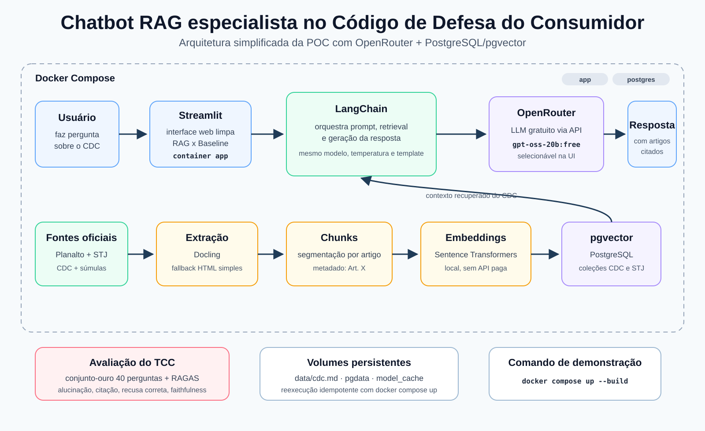

# Chatbot RAG — Código de Defesa do Consumidor (CDC)

POC para TCC em NLP: um chatbot que responde perguntas sobre o Código de Defesa
do Consumidor usando RAG, com respostas fundamentadas e rastreáveis por artigo.



## O que o projeto entrega

- RAG sobre o CDC oficial do Planalto.
- Contexto historico/institucional curado sobre origem e vigencia do CDC.
- Jurisprudência complementar curada do STJ em coleção separada.
- Segmentação do corpus por artigo do CDC.
- Embeddings locais com Sentence Transformers.
- Busca vetorial em PostgreSQL + pgvector.
- Geração via OpenRouter, usando modelo gratuito compatível com a API OpenAI.
- Seleção dinâmica de modelos gratuitos na interface para reduzir risco na apresentação.
- Interface Streamlit simples, com modo RAG e baseline sem recuperação.
- Conjunto-ouro com 40 perguntas para avaliação do TCC.
- Métricas: taxa de alucinação, precisão de citação, recusa correta e suporte a RAGAS.

## Ajuste em relação ao TCC original

O documento do TCC cita Qwen 2.5 como LLM. Para tornar a POC mais simples de
rodar em qualquer máquina, a geração foi ajustada para OpenRouter:

```env
OPENROUTER_MODEL=nvidia/nemotron-3-ultra-550b-a55b:free
LLM_MAX_TOKENS=1800
```

O restante da proposta foi mantido: LangChain, Docling, Sentence Transformers,
PostgreSQL + pgvector, Streamlit, baseline comparativo e avaliação. Para uma
avaliação acadêmica mais controlada, mantenha o mesmo modelo fixo no `.env`.
No dia da demonstração, a interface também permite escolher outro modelo gratuito
caso o modelo principal esteja indisponível.

## Enriquecimento jurídico

A POC mantém o CDC como fonte normativa principal e adiciona uma coleção separada
de súmulas do STJ sobre temas consumeristas, como bancos, planos de saúde,
fraudes bancárias, negativação, cartão não solicitado e contratos imobiliários.

Na resposta, o sistema separa:

- **Fundamento legal:** artigos do CDC.
- **Contexto historico:** origem constitucional, Lei 8.078/1990 e vigencia.
- **Jurisprudência relacionada:** súmulas do STJ, quando houver pertinência.

## Como subir

Na primeira vez, crie o `.env` e informe sua chave do OpenRouter:

```bash
cp .env.example .env
```

Depois edite `OPENROUTER_API_KEY`.

Com o `.env` pronto, suba tudo com um comando:

```bash
docker compose up --build
```

Acesse:

```text
http://localhost:8501
```

## Comandos úteis

```bash
./run.sh          # sobe app + postgres
./run.sh down     # para os containers
./run.sh ingest   # força reindexação do CDC + STJ + histórico
./run.sh eval     # roda avaliação RAG x baseline
./run.sh logs     # acompanha logs
```

## Estrutura

```text
.
├── docker-compose.yml
├── Dockerfile
├── entrypoint.sh
├── run.sh
├── requirements.txt
├── arquitetura-openrouter.svg
├── arquitetura-openrouter.png
├── corpus/
│   ├── historico_cdc.md
│   └── stj_sumulas_consumidor.md
├── data/                  # gerado em runtime
└── src/
    ├── app.py
    ├── config.py
    ├── embeddings.py
    ├── ingestion.py
    ├── rag_chain.py
    ├── models.py
    ├── golden_dataset.py
    └── evaluation.py
```
