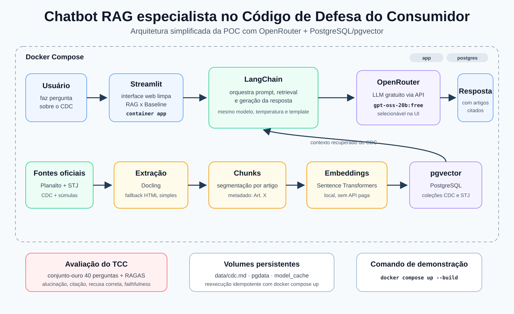

# Chatbot RAG — Código de Defesa do Consumidor (CDC)

POC para TCC em NLP: um chatbot que responde perguntas sobre o Código de Defesa
do Consumidor usando RAG, com respostas fundamentadas e rastreáveis por artigo.



> **Mapeamento do dado:** [`docs/MAPEAMENTO-DADOS.md`](docs/MAPEAMENTO-DADOS.md) —
> origem do dado, embedding, armazenamento no pgvector e leitura na interação,
> com três diagramas de fluxo.

## O que o projeto entrega

- RAG sobre o CDC oficial do Planalto.
- Contexto historico/institucional curado sobre origem e vigencia do CDC.
- Jurisprudência complementar curada do STJ em coleção separada.
- Segmentação do corpus por artigo do CDC.
- Embeddings locais com Sentence Transformers.
- Busca vetorial em PostgreSQL + pgvector.
- Geração via OpenRouter, usando modelos compatíveis com a API OpenAI.
- Seleção dinâmica de modelos gratuitos e pagos baratos na interface para reduzir risco na apresentação.
- Modelos pagos de baixo custo para validação: GPT-4o mini, Gemini 2.5 Flash Lite, DeepSeek V4 Flash e Amazon Nova Lite.
- Avaliação automática de qualidade com três avaliadores, atribuindo nota média de 0 a 5 para RAG e baseline.
- Histórico persistido no PostgreSQL, com pergunta, respostas, fontes, avaliação automática e avaliação humana.
- Interface Streamlit simples, com modo RAG e baseline sem recuperação.
- Conjunto-ouro com 40 perguntas para avaliação do TCC.
- Métricas: taxa de alucinação, precisão de citação, recusa correta e suporte a RAGAS.

## Ajuste em relação ao TCC original

O documento do TCC cita Qwen 2.5 como LLM. Para tornar a POC mais simples de
rodar em qualquer máquina, a geração foi ajustada para OpenRouter:

```env
OPENROUTER_MODEL=nvidia/nemotron-3-ultra-550b-a55b:free
LLM_MAX_TOKENS=1800
```

O restante da proposta foi mantido: LangChain, Docling, Sentence Transformers,
PostgreSQL + pgvector, Streamlit, baseline comparativo e avaliação. Para uma
avaliação acadêmica mais controlada, mantenha o mesmo modelo fixo no `.env`.
No dia da demonstração, a interface permite escolher outro modelo caso o modelo
principal esteja indisponível. Para validação de qualidade, a lista inclui quatro
modelos pagos baratos: `openai/gpt-4o-mini`, `google/gemini-2.5-flash-lite`,
`deepseek/deepseek-v4-flash` e `amazon/nova-lite-v1`. Eles só geram custo
se houver créditos na conta do OpenRouter, e os modelos marcados como gratuitos
continuam disponíveis para a demonstração.

## Enriquecimento jurídico

A POC mantém o CDC como fonte normativa principal e adiciona uma coleção separada
de súmulas do STJ sobre temas consumeristas, como bancos, planos de saúde,
fraudes bancárias, negativação, cartão não solicitado e contratos imobiliários.

Na resposta, o sistema separa:

- **Fundamento legal:** artigos do CDC.
- **Contexto historico:** origem constitucional, Lei 8.078/1990 e vigencia.
- **Jurisprudência relacionada:** súmulas do STJ, quando houver pertinência.

## Avaliação de qualidade com IA

No modo **Comparar RAG x Baseline**, a interface permite ativar uma avaliação
automática de qualidade feita por três avaliadores baratos. Essa camada recebe:

- pergunta do usuário;
- resposta gerada com RAG;
- resposta baseline sem recuperação;
- trechos do CDC, histórico e STJ recuperados pelo RAG.

Cada avaliador retorna uma nota de **0 a 5** para cada resposta. O sistema exibe
a média das três notas, informa qual resposta foi melhor e mostra as notas
individuais em detalhes. Os critérios usados são: fidelidade ao contexto
recuperado, correção dos artigos citados, completude, clareza e risco de
alucinação. Se o modelo de resposta selecionado for pago, ele não é usado como
avaliador; nesse caso, os outros três modelos pagos fazem a avaliação.

## Histórico e avaliação humana

Além da conversa em tela, cada interação é salva no PostgreSQL da POC. O registro
inclui a pergunta, resposta RAG, resposta baseline, modelo usado, fontes
recuperadas e avaliação automática. A pergunta também recebe um embedding local,
armazenado em coluna `vector`, permitindo busca semântica no histórico pelo
pgvector.

A aba **Histórico** permite:

- consultar perguntas e respostas salvas;
- visualizar notas automáticas de RAG e baseline;
- registrar uma nota humana de 0 a 5;
- calcular a média humana de qualidade das respostas;
- filtrar registros pendentes de avaliação humana.

## Como subir

Na primeira vez, crie o `.env` e informe sua chave do OpenRouter:

```bash
cp .env.example .env
```

Depois edite as chaves OpenRouter. A interface permite alternar entre elas
sem exibir os valores:

```env
OPENROUTER_API_KEY_1=sk-or-v1-...
OPENROUTER_API_KEY_2=sk-or-v1-...
OPENROUTER_API_KEY_3=sk-or-v1-...
```

Se preencher apenas `OPENROUTER_API_KEY`, ela será usada como `Chave API 1`
por compatibilidade.

Com o `.env` pronto, suba tudo com um comando:

```bash
docker compose up --build
```

Acesse:

```text
http://localhost:8501
```

## Comandos úteis

```bash
./run.sh          # sobe app + postgres
./run.sh down     # para os containers
./run.sh ingest   # força reindexação do CDC + STJ + histórico
./run.sh eval     # roda avaliação RAG x baseline
./run.sh logs     # acompanha logs
```

## Estrutura

```text
.
├── docker-compose.yml
├── Dockerfile
├── entrypoint.sh
├── run.sh
├── requirements.txt
├── arquitetura-openrouter.svg
├── arquitetura-openrouter.png
├── corpus/
│   ├── historico_cdc.md
│   └── stj_sumulas_consumidor.md
├── data/                  # gerado em runtime
└── src/
    ├── app.py
    ├── config.py
    ├── embeddings.py
    ├── ingestion.py
    ├── rag_chain.py
    ├── models.py
    ├── golden_dataset.py
    └── evaluation.py
```
