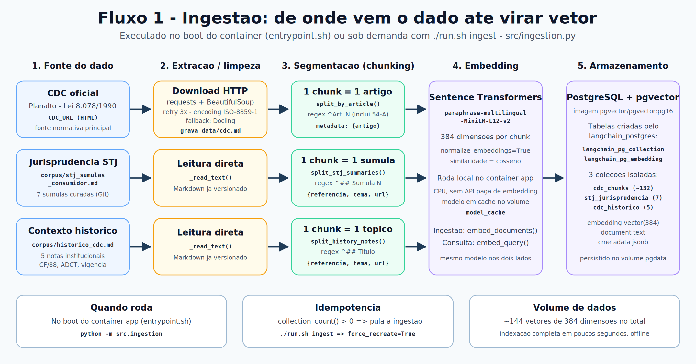
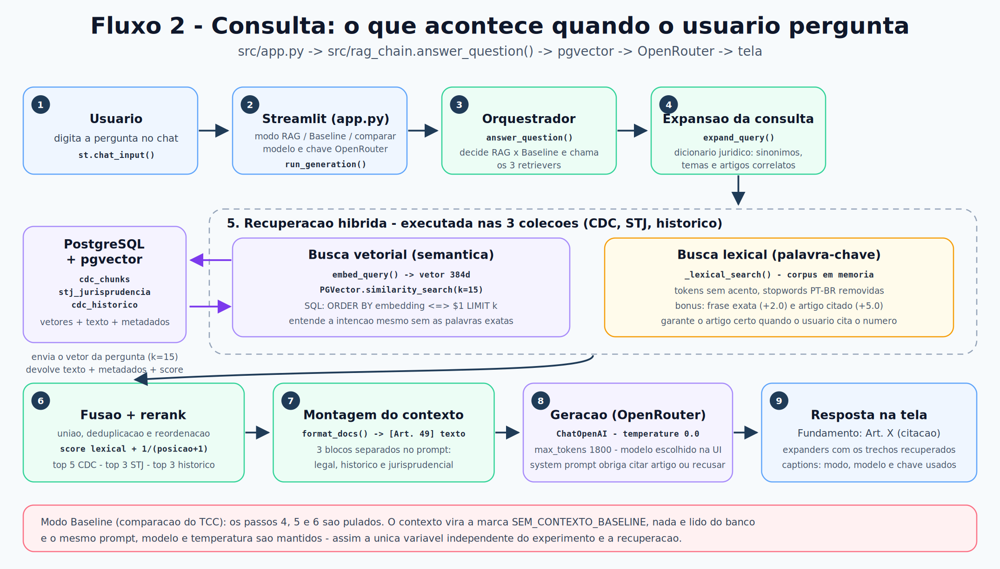
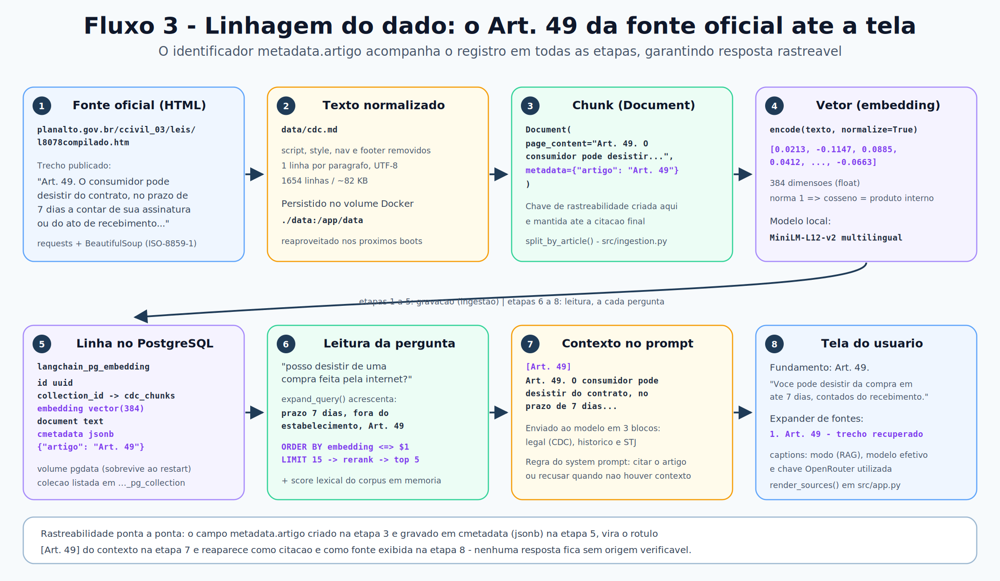

# Mapeamento do dado — resumo (1 página)

| Pergunta | Resposta |
| --- | --- |
| **1. De onde vem o dado?** | CDC oficial do Planalto (Lei 8.078/1990) baixado em HTML e salvo em `data/cdc.md`; mais dois corpora curados no Git: `corpus/stj_sumulas_consumidor.md` (7 súmulas) e `corpus/historico_cdc.md` (5 notas). |
| **2. Como vira chunk?** | **1 chunk = 1 artigo** (regex `^Art. N`), com metadado `{"artigo": "Art. 49"}`. Súmula e nota histórica viram 1 chunk cada. Total: **~144 chunks**. |
| **3. Como é feito o embedding?** | Sentence Transformers `paraphrase-multilingual-MiniLM-L12-v2`, **384 dimensões**, normalizado (cosseno), rodando **local na CPU** do container. `embed_documents()` na ingestão e `embed_query()` na pergunta — mesmo modelo nos dois lados. |
| **4. Onde é guardado?** | **PostgreSQL 16 + pgvector**, tabela `langchain_pg_embedding` (`embedding vector(384)`, `document text`, `cmetadata jsonb`), em 3 coleções: `cdc_chunks`, `stj_jurisprudencia`, `cdc_historico`. Persistido no volume `pgdata`. |
| **5. Como é lido na interação?** | Pergunta no Streamlit → `expand_query()` → **busca híbrida** (vetorial no pgvector + lexical em memória) → fusão, dedup e rerank → top 5 CDC / 3 STJ / 3 histórico → contexto rotulado `[Art. 49]` → LLM no OpenRouter (temp. 0.0) → resposta. |
| **6. Como volta pro usuário?** | Resposta começa com `Fundamento: Art. X` e a tela mostra expanders com os trechos exatos recuperados + modo, modelo e chave usados. Sem contexto, o sistema recusa. |

**Ingestão (grava)** — do Planalto ao pgvector:



**Consulta (lê)** — o que acontece quando o usuário pergunta:



**Linhagem** — o mesmo Art. 49 da fonte oficial até a citação na tela:



**Verificar no banco (demonstração ao vivo):**

```bash
docker exec -it ragcdc-postgres psql -U ragcdc -d ragcdc -c \
"SELECT c.name, COUNT(*) FROM langchain_pg_embedding e \
 JOIN langchain_pg_collection c ON c.uuid = e.collection_id GROUP BY c.name;"
```
